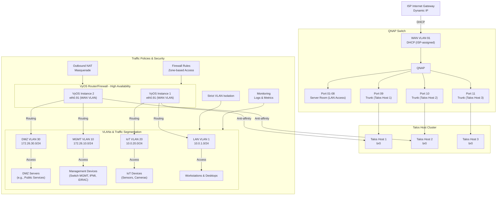

# VyOS Network Architecture

A Secure, Scalable, and Modern Networking Appliance on Kubernetes ✨🚀

Welcome to VyOS & Router / Firewall Network Architecture! This repository provides a comprehensive implementation of a secure, segmented, and scalable network architecture using VyOS as the core routing and network management platform. Whether you're a hobbyist, small business administrator, or professional network engineer, this project aims to deliver a versatile framework adaptable to various environments, including home labs, SMB networks, and enterprise scenarios. 🏠💼🌟

## Overview 🌟

VyOS serves as a powerful and flexible router OS, enabling detailed control over network configurations and security. This project leverages VyOS to create a multi-VLAN architecture that isolates traffic between zones while providing efficient routing and firewall capabilities. The design adheres to best practices in network segmentation and secure deployment, offering clear documentation and a pathway to production-grade deployments. By implementing this architecture, users can effectively manage complex network requirements while maintaining robust security measures.

### Features 🔧📖

- **Comprehensive Segmentation**: 📊 Logical separation of traffic into zones (LAN, MGMT, IoT, DMZ) via VLANs and subnets ensures clear organization and enhanced security.
- **Security-Focused**: 🛡️ Fine-grained firewall rules and NAT configurations to protect resources and control access, allowing administrators to enforce stringent policies across all zones.
- **Scalable Design**: 📈 Configurable to add new VLANs, zones, and WAN connections with minimal disruption, ensuring future growth is seamless and manageable.
- **Cloud-Native Integration**: ☁️ Deployment on Kubernetes via KubeVirt with modern specifications for cloud-native environments enables easy integration with containerized workflows.
- **Community-Driven Documentation**: 📚 Detailed guides, diagrams, and configuration examples empower contributors and users with the knowledge to customize and extend the architecture. 🌐🔥🛡️

## Project Components ⚙️⚙️

This repository includes the following files:

### 1. `README.md` 📝📚✨
This document provides a comprehensive overview of the project and serves as a reference guide for setup and usage. It is intended to help users quickly understand the project scope and operational details.

### 2. `cloud-config.userdata` 🛠️🔧📄
Defines initial VyOS configuration using cloud-init. Includes hostname, interfaces, VLANs, firewall rules, and other essential settings for first-boot automation. This ensures the VyOS instance is ready for use immediately upon deployment.

### 3. `vyos-blue.yaml` 📋🔗🛠️
The KubeVirt VM specification defining the VyOS instance. This file aligns with modern `kubevirt.io/v1` specifications, ensuring compatibility and maintainability while adhering to best practices for virtualization.

## Network Architecture 🌐

### Physical Design 🔌
The network runs on a single interface acting as a VLAN trunk (`eth0`). Traffic segmentation is achieved through VLAN tagging, with the WAN connection also on a tagged VLAN. This design simplifies physical infrastructure requirements while maintaining logical isolation. 🧙

### Logical Design 🧠
The network is segmented into distinct VLANs and subnets to achieve robust security and efficient traffic management. Each VLAN serves a specific purpose:

| **Zone** | **VLAN ID** | **Subnet**         | **Purpose**                                      |
|----------|-------------|--------------------|--------------------------------------------------|
| WAN      | 91          | DHCP (ISP-assigned)| 🌐 Internet connectivity and NAT for internal zones.|
| LAN      | 1 (untagged)| `10.0.1.0/24`      | 💻 Default internal network for general devices.    |
| MGMT     | 10          | `172.26.10.0/24`   | 🔧 Management network for infrastructure.           |
| IoT      | 20          | `10.0.20.0/24`     | 🤖 Isolated network for IoT devices.                |
| DMZ      | 30          | `172.26.30.0/24`   | 🌎 Externally accessible services and servers.      |

Each VLAN and its corresponding subnet are configured to minimize conflicts, ensuring reliable operation in environments with multiple overlapping networks. 🔑🔧🌐

### Deployment Diagram 📊🖼️📡
Below is a representation of the architecture using Mermaid.js:



This diagram illustrates the logical relationships between zones, ensuring clarity in network design and simplifying troubleshooting efforts. 📐🔍📶


### QNAP Switch Configuration

| Port | Description                    | VLAN 1 (LAN) | VLAN 10 (MGMT) | VLAN 20 (IoT) | VLAN 30 (DMZ) | VLAN 91 (WAN) |
|------|--------------------------------|--------------|----------------|---------------|---------------|---------------|
| 01   | General server room use        | ❌           | 🚫             | 🚫            | 🚫            | 🚫            |
| 02   | General server room use        | ❌           | 🚫             | 🚫            | 🚫            | 🚫            |
| 03   | General server room use        | ❌           | 🚫             | 🚫            | 🚫            | 🚫            |
| 04   | General server room use        | ❌           | 🚫             | 🚫            | 🚫            | 🚫            |
| 05   | General server room use        | ❌           | 🚫             | 🚫            | 🚫            | 🚫            |
| 06   | General server room use        | ❌           | 🚫             | 🚫            | 🚫            | 🚫            |
| 07   | General server room use        | ❌           | 🚫             | 🚫            | 🚫            | 🚫            |
| 08   | WAN / Server Room Drop         | 🚫           | 🚫             | 🚫            | 🚫            | ❌            |
| 09   | Talos Host 1 (trunk to br0)    | ✅           | ✅             | ✅            | ✅            | ✅            |
| 10   | Talos Host 2 (trunk to br0)    | ✅           | ✅             | ✅            | ✅            | ✅            |
| 11   | Talos Host 3 (trunk to br0)    | ✅           | ✅             | ✅            | ✅            | ✅            |
| 12   | Reserved for expansion         | ✅           | ✅             | ✅            | ✅            | ✅            |

> 
> Key:
> 
> ✅ = Tagged
> ❌ = Untagged
> 🚫 = Excluded
>

#### Explanation of the Configuration:
1. **Ports 01-08 (1GbE)**:
   - Configured for untagged VLAN 1 traffic (default LAN network: `10.0.1.0/24`).
   - No tagged VLANs on these ports, suitable for general devices or servers without VLAN tagging support.

2. **Ports 09-11 (10GbE, SFP+ for Talos Hosts)**:
   - Configured as **trunk ports**:
     - **Tagged** for VLANs: `10` (MGMT), `20` (IoT), `30` (DMZ), and `91` (WAN).
     - **Tagged** for VLAN 1 for the LAN traffic (untagged on the Talos hosts, handled by `br0`).
   - These ports allow full VLAN traffic to pass through for Talos hosts and their Linux bridges (`br0`).

3. **Port 12 (10GbE, Reserved for Future Expansion)**:
   - Also configured as a trunk with the same VLAN tagging setup as ports 09-11 to support additional Talos nodes or other networking requirements.

#### Notes:
- **WAN VLAN (91)**: Ensure DHCP configuration is properly applied on VLAN 91 for WAN traffic.
- **Management VLAN (10)**: Ensure secure access controls are implemented to prevent unauthorized access to the MGMT VLAN.
- **Tagged vs. Untagged**:
  - **Tagged (✅)**: VLAN traffic carries VLAN IDs for isolation (used on trunk ports).
  - **Untagged (❌)**: Default traffic with no VLAN tag (used for general access ports).
  - **Excluded (🚫)**: VLAN traffic is explicitly

### Traffic Flow 🌊🔄🚦
Traffic policies enforce:

- Strict isolation between VLANs unless explicitly allowed by firewall rules. 🚧
- Outbound NAT masquerading for traffic destined to the WAN, ensuring secure and private communication for internal devices. 🔒
- Limited cross-zone communication (e.g., IoT cannot access LAN), providing an additional layer of security by default. 🔐🔁🌉

## Getting Started 🛠️🚀📋

### Prerequisites 📦⚙️✅

1. **Environment**:
   - Kubernetes cluster with KubeVirt installed. 🖥️
   - Access to kubectl with permissions to create secrets and deploy resources. 🔐

2. **Tools**:
   - Mermaid CLI for diagram generation (optional). 📊
   - VyOS ISO or container image. 📦

### Setup Steps 🚧⚡📜

1. **Create a Secret for `userdata`**:
   ```bash
   kubectl create secret generic vyos-cloudconfig \
       --from-file=userdata=cloud-config.userdata \
       --dry-run=client -o yaml | kubectl apply -f -
   ```

   This step ensures that the VyOS configuration is securely stored and accessible to the KubeVirt VM during initialization. 🔐📂✨

2. **Deploy the VM**:
   ```bash
   kubectl apply -f vyos-blue.yaml
   ```

   This command deploys the VyOS virtual machine, initiating the process of setting up the network architecture. 🚀🖥️🗂️

3. **Verify Connectivity**:
   - Ensure devices in each VLAN receive the correct DHCP-assigned IPs. 🖧
   - Test routing between VLANs and Internet access. 🌐📡✔️

4. **Monitor and Adjust**:
   - Use `deploy.sh` for managing updates and redeployments. 🔄
   - Regularly review firewall logs and configurations to ensure optimal performance and security. 🔎🛡️

## Contributing 🤝🌍🛠️

We welcome contributions from the community to improve this project. Contributions can include:

- Enhancements to the deployment process, making it more robust and user-friendly. 💡
- Bug fixes and security updates to maintain reliability and integrity. 🛠️
- New features and integrations that expand the functionality of the architecture. 🚀

Please follow the guidelines in `CONTRIBUTING.md` to submit your contributions. Collaboration and feedback from the community are vital to the project's success. ✨🤝📈

## Context and Usage 🌐🖥️💡

This architecture is designed to seamlessly integrate into larger cloud-native infrastructure solutions, such as those powered by Kargo and Konductor. It replaces traditional networking components (e.g., OpenStack-based solutions) with a Kubernetes-native approach for routing and network management. By leveraging this VyOS-based implementation, users can build advanced networks that support overlay configurations, tenant isolation, and secure interconnectivity across hybrid environments. 🔗🏗️🌍

The integration with KubeVirt allows for flexibility and scalability, making it ideal for environments ranging from small-scale home labs to enterprise-grade deployments. The modular nature of this architecture ensures that it can be easily adapted to meet specific use cases, providing a solid foundation for innovation. 🏗️🚀💻

## Acknowledgments 🌟🤝📚

- The VyOS community for creating an excellent open-source router OS that serves as the backbone of this architecture. 🛡️
- KubeVirt for simplifying VM deployments on Kubernetes and enabling seamless integration with modern cloud-native environments. ☁️
- Mermaid.js for enabling simple and version-controlled diagrams that enhance documentation clarity. ✨🔗📊

