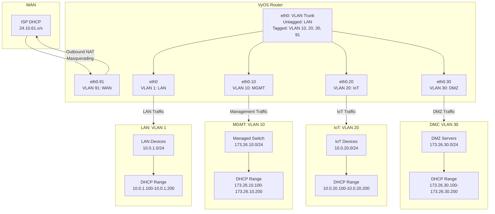

# VyOS Network Architecture

## Overview

This project implements a modern and scalable network architecture using VyOS as the routing and network management platform. The design focuses on segmentation, security, and scalability while maintaining clarity and ease of management. The configuration is suitable for hobbyists, administrators, and network engineers of all levels, offering flexibility for home, small business, or lab environments.

- **WAN**: Represents the ISP-assigned DHCP address range.
- **VyOS Router**: Shows the VLAN trunk with both tagged and untagged traffic and how each VLAN corresponds to its purpose.
- **LAN, MGMT, IoT, DMZ**: Each segment has its own subnet, devices, and DHCP range.
- **Traffic Flow**: Arrows represent the flow of traffic and responsibilities of each VLAN.



---

## Network Architecture

### Segments and VLANs

The network is segmented into distinct VLANs and IP subnets to provide isolation and prevent cross-traffic unless explicitly allowed by firewall rules. The IP ranges avoid common conflicts with consumer-grade networks (`192.168.x.x`), and VLAN IDs align with the 3rd octet of their respective subnets for intuitive management.

| **Network** | **Subnet**         | **VLAN ID** | **Purpose**                                      |
|-------------|--------------------|-------------|--------------------------------------------------|
| **WAN**     | DHCP (ISP-assigned)| 91          | Primary WAN connection. Configured for scalability (multi-WAN support). |
| **LAN**     | `10.0.1.0/24`      | 1 (untagged)| Default internal network for general-purpose devices. |
| **MGMT**    | `173.26.10.0/24`   | 10          | Management network for infrastructure devices.   |
| **IoT**     | `10.0.20.0/24`     | 20          | Isolated network for IoT devices with stricter access controls. |
| **DMZ**     | `173.26.30.0/24`   | 30          | Demilitarized zone for externally accessible services. |

---

### Key Design Considerations

- **Avoid Address Conflicts**: Avoids `192.168.x.x` to prevent collisions with consumer-grade modems.
- **VLAN and Subnet Alignment**: VLAN IDs correspond to the 3rd octet of their subnet, making documentation and troubleshooting more intuitive.
- **Scalability**: The architecture supports additional WAN connections and new VLANs without disrupting existing setups.
- **Single Interface Router**: A single network interface (`eth0`) acts as a VLAN trunk, carrying all tagged traffic except for untagged LAN traffic.

---

## Router Responsibilities

1. **Routing**: Routes traffic between VLANs while enforcing strict firewall rules to control access.
2. **DHCP**: Provides IP addresses within their respective ranges for LAN, IoT, DMZ, and MGMT networks. WAN is DHCP-assigned by the ISP.
3. **NAT**: Masquerades outbound traffic from internal networks through the WAN interface.
4. **Firewall**:
   - **WAN** → **Internal Networks**: Default deny with specific allow rules for required services.
   - **IoT** → **LAN**: Deny all traffic by default.
   - **DMZ** → **LAN**: Restricted access based on service requirements.
   - **MGMT** → **All**: Limited to administrative users/devices only.

---

## Configuration Summary

### Interfaces and VLANs

| **Interface** | **VLAN** | **IP Address**      | **Purpose**               |
|---------------|----------|---------------------|---------------------------|
| `eth0`        | 1        | `10.0.1.1/24`       | Default LAN (untagged).   |
| `eth0.10`     | 10       | `173.26.10.1/24`    | Management network.       |
| `eth0.20`     | 20       | `10.0.20.1/24`      | IoT network.              |
| `eth0.30`     | 30       | `173.26.30.1/24`    | DMZ network.              |
| `eth0.91`     | 91       | DHCP (ISP-assigned) | WAN (primary Internet).   |

### DHCP Ranges

| **Network** | **Subnet**        | **Range**                  |
|-------------|-------------------|----------------------------|
| **LAN**     | `10.0.1.0/24`     | `10.0.1.100 - 10.0.1.200`  |
| **MGMT**    | `173.26.10.0/24`  | `173.26.10.100 - 173.26.10.200` |
| **IoT**     | `10.0.20.0/24`    | `10.0.20.100 - 10.0.20.200` |
| **DMZ**     | `173.26.30.0/24`  | `173.26.30.100 - 173.26.30.200` |

---

## Firewall Policy Highlights

1. **WAN**:
   - Deny all inbound traffic except for explicitly allowed services (e.g., SSH, web server access).
   - Allow related/established traffic.
2. **LAN**:
   - Allow unrestricted communication within the LAN.
   - Permit LAN devices to access WAN.
3. **MGMT**:
   - Allow only administrative access to other networks.
4. **IoT**:
   - Restrict IoT devices from accessing the LAN and MGMT networks.
   - Allow IoT devices to access the Internet.
5. **DMZ**:
   - Permit public-facing services with restricted access to internal networks.

---

## Example Deployment Steps

1. **Create a Secret for UserData**:
   ```bash
   kubectl create secret generic vyos-cloudconfig \
       --from-file=userdata=cloud-config.yaml \
       --dry-run=client -o yaml | kubectl apply -f -
   ```

2. **Deploy the Virtual Machine**:
   ```bash
   kubectl apply -f vyos-vm.yaml
   ```

3. **Verify Network Connectivity**:
   - Ensure devices in each VLAN receive the correct DHCP-assigned IPs.
   - Test routing between VLANs and Internet access via WAN.

4. **Monitor and Adjust Firewall Rules**:
   - Use `show configuration commands` to verify configuration.
   - Modify firewall policies as necessary to accommodate new services or devices.

---

## IP Address Management (IPAM)

| **Hostname**  | **IP Address**       | **Subnet**       | **VLAN** | **MAC Address**   | **Role**       | **Interface** | **Notes**                     |
|---------------|----------------------|------------------|----------|-------------------|----------------|---------------|
| vyos-router   | `10.0.1.1`           | `10.0.1.0/24`    | 1        | Randomized        | Router         | `eth0`        | Untagged LAN.                 |
| vyos-router   | DHCP (via ISP)       | WAN (dynamic)    | 91       | Randomized        | Router         | `eth0.91`     | Primary WAN.                  |
| IoT-device-1  | `10.0.20.101`        | `10.0.20.0/24`   | 20       | Randomized        | IoT Device     | `eth0.20`     | Smart Thermostat.             |
| DMZ-server-1  | `173.26.30.101`      | `173.26.30.0/24` | 30       | Randomized        | DMZ Server     | `eth0.30`     | Public-facing web server.     |
| mgmt-switch-1 | `173.26.10.2`        | `173.26.10.0/24` | 10       | Randomized        | Switch         | `eth0.10`     | Management switch connection. |

