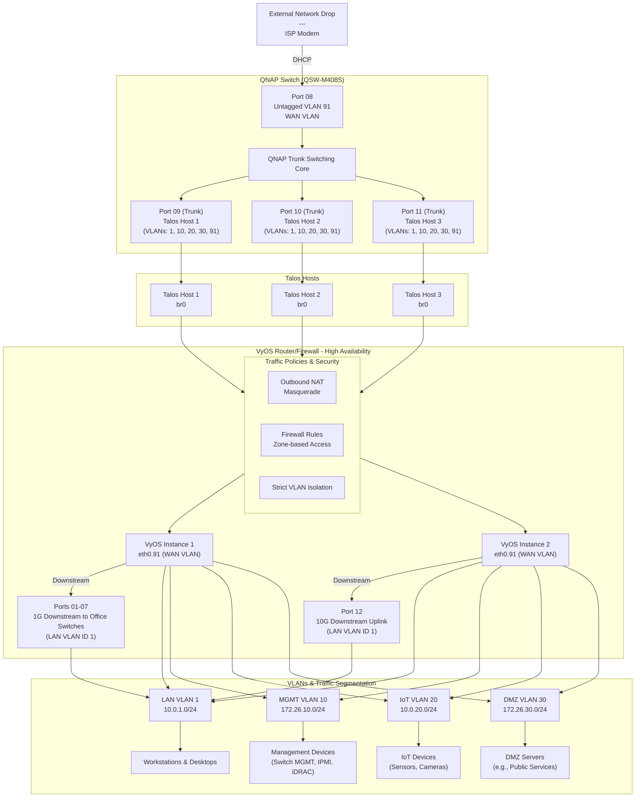

# K8s Kubevirt VyOS QNAP Network Architecture

A Secure, Scalable, and Modern Networking Appliance on Kubernetes ✨🚀

An advanced Kubevirt + VyOS Network Architecture providing a comprehensive implementation of a secure, segmented, and scalable network architecture using VyOS as the core routing and network management platform. Whether you're a hobbyist, small business administrator, or professional network engineer, this sample project offers a starting point to deliver a versatile network framework adaptable to various environments, including home labs, SMB networks, and enterprise scenarios. 🏠💼🌟

## Overview 🌟

**VyOS**: is a powerful and flexible router OS, enabling detailed control over network configurations and security. This project leverages VyOS to create a multi-VLAN architecture that isolates traffic between zones while providing efficient routing and firewall capabilities. The design adheres to best practices in network segmentation and secure deployment, offering clear documentation and a pathway to production-grade deployments. By implementing this architecture, users can effectively manage complex network requirements while maintaining robust security measures.

**Kubevirt**: is a powerful and flexible virtualization platform, enabling detailed control over network configurations and security. This project leverages Kubevirt to orchestrate the deployment of VyOS instances on Kubernetes.

**Talos**: is a modern Kubernetes Linux distribution, offering the smoothest Kubernetes experience for your infrastructure.

### Features 🔧📖

- **Segmentation**: 📊 Logical separation of traffic into zones (LAN, MGMT, IoT, DMZ) via VLANs and subnets ensures clear organization and enhanced security.
- **Security**: 🛡️ Fine-grained firewall rules and NAT configurations to protect resources and control access, allowing administrators to enforce stringent policies across all zones.
- **Scalable**: 📈 Configurable to add new VLANs, zones, and WAN connections with minimal disruption, ensuring future growth is seamless and manageable.
- **Cloud-Native**: ☁️ Deployment on Kubernetes via KubeVirt with modern specifications for cloud-native environments enables easy integration with containerized workflows.

## Network Architecture 🌐

### Physical Design 🔌

This network architecture is designed for a single interface Upstream / WAN / ISP connection. It runs on a single interface acting as a VLAN trunk (`eth0`). Traffic segmentation is achieved through VLAN tagging, with the WAN connection also on a tagged VLAN. This design simplifies physical infrastructure requirements while maintaining logical isolation. 🧙

Implementation requires at least a managed switch with VLAN support.

### Logical Design 🧠
The network is segmented into distinct VLANs and subnets to achieve robust security and efficient traffic management. Each VLAN serves a specific purpose:

| **Zone** | **VLAN ID** | **Subnet**         | **Purpose**                                      |
|----------|-------------|--------------------|--------------------------------------------------|
| WAN      | 91          | DHCP (ISP-assigned)| 🌐 Internet connectivity and NAT for internal zones.|
| LAN      | 1 (untagged)| `10.0.1.0/24`      | 💻 Default internal network for general devices.    |
| MGMT     | 10          | `172.26.10.0/24`   | 🔧 Management network for infrastructure.           |
| IoT      | 20          | `10.0.20.0/24`     | 🤖 Isolated network for IoT devices.                |
| DMZ      | 30          | `172.26.30.0/24`   | 🌎 Externally accessible services and servers.      |

Each VLAN and its corresponding subnet are configured to minimize conflicts, ensuring reliable operation in environments with multiple overlapping networks. 🔑🔧🌐

### Deployment Diagram 📊🖼️📡
Below is a representation of the architecture using Mermaid.js:



This diagram illustrates the logical relationships between hardware, VyOS instances, zones, and VLANs, ensuring clarity in network design and simplifying troubleshooting efforts. 📐🔍📶


### QNAP Switch Configuration

| Port | Description                    | VLAN 1 (LAN) | VLAN 10 (MGMT) | VLAN 20 (IoT) | VLAN 30 (DMZ) | VLAN 91 (WAN) |
|------|--------------------------------|--------------|----------------|---------------|---------------|---------------|
| 01   | Generic Server                 | ❌           | 🚫             | 🚫            | 🚫            | 🚫            |
| 02   | Generic Server                 | ❌           | 🚫             | 🚫            | 🚫            | 🚫            |
| 03   | Generic Server                 | ❌           | 🚫             | 🚫            | 🚫            | 🚫            |
| 04   | Generic Server                 | ❌           | 🚫             | 🚫            | 🚫            | 🚫            |
| 05   | Generic Server                 | ❌           | 🚫             | 🚫            | 🚫            | 🚫            |
| 06   | Generic Server                 | ❌           | 🚫             | 🚫            | 🚫            | 🚫            |
| 07   | Generic Server                 | ❌           | 🚫             | 🚫            | 🚫            | 🚫            |
| 08   | ISP WAN / Server Room Drop     | 🚫           | 🚫             | 🚫            | 🚫            | ❌            |
| 09   | Talos Host 1 (trunk to br0)    | ✅           | ✅             | ✅            | ✅            | ✅            |
| 10   | Talos Host 2 (trunk to br0)    | ✅           | ✅             | ✅            | ✅            | ✅            |
| 11   | Talos Host 3 (trunk to br0)    | ✅           | ✅             | ✅            | ✅            | ✅            |
| 12   | Reserved for expansion         | ✅           | ✅             | ✅            | ✅            | ✅            |

>
> Key:
>
> ✅ = Tagged
> ❌ = Untagged
> 🚫 = Excluded
>

#### Explanation of the Configuration:
1. **Ports 01-08 (1GbE)**:
   - 01-07: Configured for untagged VLAN 1 traffic (default LAN network: `10.0.1.0/24`).
   - 08: VLAN 91 (WAN) External Network / WAN / Server Room Drop

2. **Ports 09-11 (10GbE, SFP+ for Talos Hosts)**:
   - Configured as **trunk ports**:
     - **Tagged** for VLANs: `10` (MGMT), `20` (IoT), `30` (DMZ), and `91` (WAN).
     - **Tagged** for VLAN 1 for the LAN traffic (untagged on the Talos hosts, handled by `br0`).
   - These ports allow full VLAN traffic to pass through for Talos hosts and their Linux bridges (`br0`).

3. **Port 12 (10GbE, Reserved for Future Expansion)**:
   - Also configured as a trunk with the same VLAN tagging setup as ports 09-11 to support additional Talos nodes or other networking requirements.

#### Notes:
- **External Network / WAN VLAN (91)**: DHCP assigned IP address from external network.
- **Management VLAN (10)**: Management devices (Switch MGMT, IPMI, iDRAC)
- **Tagged vs. Untagged**:
  - **Tagged (✅)**: VLAN traffic carries VLAN IDs for isolation (used on trunk ports).
  - **Untagged (❌)**: Single VLAN traffic only, interface is dedicated to a single VLAN.
  - **Excluded (🚫)**: VLAN traffic is explicitly excluded from these ports.

### Traffic Flow 🌊🔄🚦
Traffic policies enforce:

- Strict isolation between VLANs unless explicitly allowed by firewall rules. 🚧
- Outbound NAT masquerading for traffic destined to the WAN, ensuring secure and private communication for internal devices. 🔒
- DMZ VLAN NAT from internal devices to DMZ, secure and private communication for external and internal devices. 🔒
- Limited cross-zone communication (e.g., IoT cannot access LAN), providing an additional layer of security by default. 🔐🔁🌉

## Getting Started 🛠️🚀📋

## SDN Components ⚙️⚙️

### Prerequisites 📦⚙️✅

1. **Environment**:
   - Kubernetes cluster with KubeVirt installed. 🖥️
   - Access to kubectl with permissions to create secrets and deploy resources. 🔐
   - Access to a QNAP switch with VLAN support. 🖥️
   - Bare Metal or Virtualized environment with Talos installed and at least 1 network interface. 🖥️

### Setup Steps 🚧⚡📜

1. **Create a Secret for `userdata`**:
   ```bash
   kubectl create secret generic vyos-cloudconfig \
       --from-file=userdata=cloud-config.userdata \
       --dry-run=client -o yaml | kubectl apply -f -
   ```

   This step ensures that the VyOS configuration is securely stored and accessible to the KubeVirt VM during initialization. 🔐📂✨

2. **Deploy the VM**:
   ```bash
   kubectl apply -f vyos-blue.yaml
   ```

   This command deploys the VyOS virtual machine, initiating the process of setting up the network architecture. 🚀🖥️🗂️

3. **Monitor and Adjust**:
   - Regularly review firewall logs and configurations to ensure optimal performance and security. 🔎🛡️

## Contributing 🤝🌍🛠️

We welcome contributions from the community to improve this project. Contributions can include:

- Enhancements to the deployment process, making it more robust and user-friendly. 💡
- Bug fixes and security updates to maintain reliability and integrity. 🛠️
- New features and integrations that expand the functionality of the architecture. 🚀

Please follow the guidelines in `CONTRIBUTING.md` to submit your contributions. Collaboration and feedback from the community are vital to the project's success. ✨🤝📈

## Context and Usage 🌐🖥️💡

This architecture is designed to seamlessly integrate into larger cloud-native infrastructure solutions, such as those powered by the ContainerCraft Kargo and Konductor projects. It replaces traditional and proprietary networking components with a Cloud Native Kubernetes architecture for firewall, routing, and network management. By leveraging this VyOS-based implementation, users can build advanced networks that support overlay configurations, tenant isolation, and secure interconnectivity across hybrid environments. 🔗🏗️🌍

The integration with KubeVirt allows for flexibility and scalability, making it ideal for environments ranging from small-scale home labs to enterprise-grade deployments.

## Acknowledgments 🌟🤝📚

- The VyOS community for creating an excellent open-source router OS that serves as the backbone of this architecture. 🛡️
- KubeVirt for simplifying VM deployments on Kubernetes and enabling seamless integration with modern cloud-native environments. ☁️
- Mermaid.js for enabling simple and version-controlled diagrams that enhance documentation clarity. ✨🔗📊
